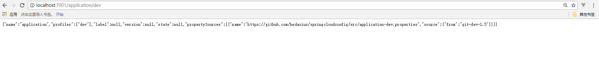
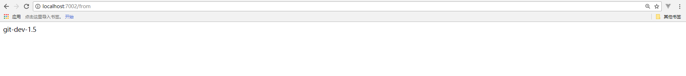

## Config 微服务的统一配置管理中心
### 由来

对于传统的单体应用，通常使用配置文件管理所有的配置。
例如一个Spring Boot开发的单体应用，可将配置内容放在application.properties文件中/如果需要切换环境，可设置多个Profile，并在启动应用时指定spring.profiles.active={profile}。
而在微服务架构中，微服务的配置管理有以下需求：
- 1 . 集中管理配置：一个使用微服务架构的应用系统可能包含几十上百或者上千个的微服务，因此集中管理配置是非常有必要的
- 2 . 不同环境不同配置：例如，数据源配置在不同的环境（开发、测试、预发布、生产等）中是不同的
- 3 . 运行期间可动态调整：例如，可根据各个微服务的负载情况，动态调整数据源连接池大小或者熔断阈值，并且在调整配置时不停止微服务
- 4 . 配置修改后可自动更新：如果配置内容发生变化，微服务能够自动更新配置

综上，对于微服务架构而言，一个通用的配置管理机制是必不可少的

### Spring Cloud Config介绍
Spring Cloud Config为分布式系统外部化配置提供了服务器端和客户端的支持，它包括Config Server和Config Client两部分。
Config Server是一个可横向扩展、集中式的配置服务器，它用于集中管理应用程序各个环境下的配置，默认使用Git存储配置内容，因此可以很方便的实现对配置的版本控制和内容审计
Config Client是Config Server的客户端（微服务架构系统中的每个微服务均可是Config Client），用于操作存储在Config Server中的配置属性.

### 创建Config Server
- 1 . 创建一个Spring Boot项目，使用Maven作为项目管理与构建工具
- 2 . 在Pom.xml中添加Spring Cloud 和Config Server的依赖

```
<parent>
    <groupId>org.springframework.boot</groupId>
    <artifactId>spring-boot-starter-parent</artifactId>
    <version>1.5.4.RELEASE</version>
    <relativePath/>
</parent>

<dependencies>
    <dependency>
        <groupId>org.springframework.cloud</groupId>
        <artifactId>spring-cloud-config-server</artifactId>
    </dependency>
</dependencies>

<dependencyManagement>
    <dependencies>
        <dependency>
           <groupId>org.springframework.cloud</groupId>
           <artifactId>spring-cloud-dependencies</artifactId>
           <version>Dalston.SR1</version>
           <type>pom</type>
           <scope>import</scope>
        </dependency>
    </dependencies>
</dependencyManagement>

```

- 3 . 在项目启动类中添加@EnableConfigServer注解，开启Spring Cloud Config的服务端功能

```
@EnableConfigServer
@SpringBootApplication
public class Application {

	public static void main(String[] args) {
		new SpringApplicationBuilder(Application.class).web(true).run(args);
	}

}
```

- 4 . 在application.properties中添加配置服务的基本信息以及Git仓库的相关信息

```
spring.application.name=config-server
server.port=7001

# git管理配置
spring.cloud.config.server.git.uri=https://github.com/hedaxius/springcloudconfig  //Git仓库地址
spring.cloud.config.server.git.searchPaths=src  //Git仓库中的搜索路径
spring.cloud.config.server.git.username=xxx //访问Git仓库的用户名
spring.cloud.config.server.git.password=yyy //访问Git仓库的用户密码
```

- 5 . 在Git中准备一个配置文件仓库，例如：springcloudconfig项目的Src目录下有一个application-dev.properties文件，内容如下

```
from=git-dev-1.5
```

- 6 . 启动项目，浏览器打开localhost:7001/application/dev


### 微服务改造为Config Client

- 1 . 微服务需为Spring Boot项目

- 2 . 在pom.xml中添加Spring Cloud和Config Client的依赖

```
 <parent>
    <groupId>org.springframework.boot</groupId>
    <artifactId>spring-boot-starter-parent</artifactId>
    <version>1.5.4.RELEASE</version>
    <relativePath/>
  </parent>

  <dependencyManagement>
    <dependencies>
      <dependency>
        <groupId>org.springframework.cloud</groupId>
        <artifactId>spring-cloud-dependencies</artifactId>
        <!--<version>Camden.SR6</version>-->
        <version>Dalston.SR1</version>
        <type>pom</type>
        <scope>import</scope>
      </dependency>
    </dependencies>
  </dependencyManagement>

  <properties>
    <project.build.sourceEncoding>UTF-8</project.build.sourceEncoding>
  </properties>

  <dependencies>
    <dependency>
      <groupId>org.springframework.boot</groupId>
      <artifactId>spring-boot-starter-web</artifactId>
    </dependency>
    <dependency>
      <groupId>org.springframework.cloud</groupId>
      <artifactId>spring-cloud-starter-config</artifactId>
    </dependency>

  </dependencies>
```

- 3 . 配置bootstrap.properties，注意是bootstrap.properties

```

# 指定微服务名称（与配置文件name）,配置文件的命名规范请自行百度
spring.application.name=application 
# 指定微服务profile(与配置文件中的profile一致)
spring.cloud.config.profile=dev
# 指定git分支
spring.cloud.config.label=master
#指定配置中心地址
spring.cloud.config.uri=http://localhost:7001/ 

server.port=7002 
```

- 4 . 创建测试类

```
@RestController
public class TestController {

    @Value("${from}")
    private String from;

    @RequestMapping("/from")
    public String from() {

        return this.from;
    }
}

```

- 5 . 启动微服务，在浏览器中打开localhost:7002/form

