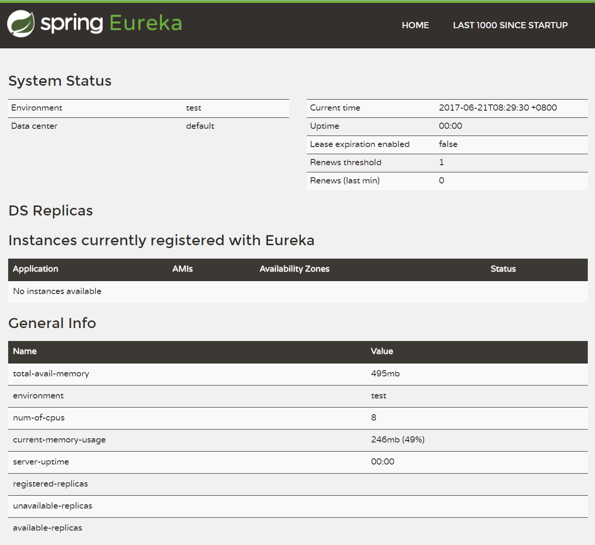

## Eureka 服务注册中心


### 由来

使用微服务构建的是分布式系统，微服务之间通过网络进行通信。
我们使用服务提供者和服务消费者来描述微服务之间的调用关系，传统应用程序中的调用方式是服务提供者的网络地址（IP、端口）硬编码在代码中或者提取到配置文件中。
然而硬编码的方式有很多局限性：
适用场景有局限，如果服务提供者的网络地址发生了变化，将会影响消费者；
无法动态伸缩，在生产环境中，每个微服务一般会部署多个实例，从而实现容灾和负载均衡，而硬编码无法适应动态增加服务节点需求。
而服务发现组件提供了一个强大的服务发现机制，服务消费者使用这种机制获取服务提供者的网络信息

### Eureka组件介绍

Eureka是Netflix开源的服务发现组件，本身是一个基于REST的服务，它包含Eureka Server和Eureka Client两部分。


#### 核心功能

- 1. 服务注册表
服务发现组件的核心，用于记录各个微服务的网络信息，Eureka Server负责维护此表。
服务注册表提供查询API和管理API，查询API用于查询可用的微服务实例，管理API用于服务的注册和注销
- 2 . 服务注册与服务发现
服务注册是指微服务在启动时，将自己的信息注册到Eureka Server上的过程。服务发现是指Eureka Client查询可用微服务列表及其网络信息的机制
- 3 . 服务检查
服务发现组件使用一定机制（心跳检查）定时检测已注册的服务，若发现某实例长时间无法访问，就将其从服务注册表中移除

#### 创建 Eureka Server

- 1 . 创建一个Spring Boot项目，使用Maven作为项目管理与构建工具
- 2 . 在pom.xml中引入Spring Cloud依赖以及Eureka Server的依赖

```
<parent>
    <groupId>org.springframework.boot</groupId>
    <artifactId>spring-boot-starter-parent</artifactId>
    <version>1.5.4.RELEASE</version>
    <relativePath/>
</parent>

<dependencies>
    <dependency>
        <groupId>org.springframework.cloud</groupId>
        <artifactId>spring-cloud-starter-eureka-server</artifactId>
    </dependency>
</dependencies>

<dependencyManagement>
    <dependencies>
        <dependency>
           <groupId>org.springframework.cloud</groupId>
           <artifactId>spring-cloud-dependencies</artifactId>
           <version>Dalston.SR1</version>
           <type>pom</type>
           <scope>import</scope>
        </dependency>
    </dependencies>
</dependencyManagement>
```

- 3 . 在项目启动类中添加@EnableEurekaServer注解

```
@EnableEurekaServer
@SpringBootApplication
public class Application {

    public static void main(String[] args) {
        new SpringApplicationBuilder(Application.class)
                    .web(true).run(args);
    }
}
```

- 4 . 在application.properties配置文件中添加如下信息

```
spring.application.name=eureka-server 
server.port=8080

eureka.instance.hostname=localhost 
eureka.client.register-with-eureka=false //禁用客户端注册行为
eureka.client.fetch-registry=false
```

- 5 . 启动项目，在浏览器中打开localhost:8080可见Eureka Server的管理页面


#### 将微服务改造成Eureka Client

Eureka Client作为服务提供者，向服务注册中心Eureka Server注册自己；而作为服务消费者，可以向服务注册中心查询其他服务注册信息，并提供所有注册信息缓存到本地的机制，避免Eureka Server宕机

- 1 . 微服务首先必须是Spring Boot项目
- 2 . 在pom.xml中添加Spring Cloud以及Eureka Client的依赖

```
<parent> 
    <groupId>org.springframework.boot</groupId>
    <artifactId>spring-boot-starter-parent</artifactId>
    <version>1.5.4.RELEASE</version>
    <relativePath/> <!-- lookup parent from repository -->
</parent>

<dependencies>
    <dependency>
        <groupId>org.springframework.cloud</groupId>
        <artifactId>spring-cloud-starter-eureka</artifactId>
    </dependency>
    <dependency>
        <groupId>org.springframework.boot</groupId>
        <artifactId>spring-boot-starter-web</artifactId>
    </dependency>
</dependencies>

<dependencyManagement>
    <dependencies>
        <dependency>
           <groupId>org.springframework.cloud</groupId>
           <artifactId>spring-cloud-dependencies</artifactId>
           <version>Dalston.SR1</version>
           <type>pom</type>
           <scope>import</scope>
        </dependency>
    </dependencies>
</dependencyManagement>
```

- 3 . 实现/dc请求处理接口

通过DiscoveryClient对象，在日志中打印出服务实例的相关内容

```
@RestController
public class DcController {

    @Autowired
    DiscoveryClient discoveryClient;

    @GetMapping("/dc")
    public String dc() {
        String services = "Services: " + discoveryClient.getServices();
        System.out.println(services);
        return services;
    }

}
```

- 4 . 在微服务启动类中添加@EnableDiscoveryClient注解

该注解能激活Eureka中的DiscoveryClient实现，这样才能实现Controller中对服务信息的输出。

```
@EnableDiscoveryClient
@SpringBootApplication
public class Application {
    public static void main(String[] args) {
        new SpringApplicationBuilder(
            ComputeServiceApplication.class)
            .web(true).run(args);
    }
}
```

- 5 . 在application.properties配置文件中添加如下信息

```
spring.application.name=eureka-client
server.port=2001
eureka.client.serviceUrl.defaultZone=http://localhost:8080/eureka/
```

通过spring.application.name属性，我们可以指定微服务的名称后续在调用的时候只需要使用该名称就可以进行服务的访问。
eureka.client.serviceUrl.defaultZone属性对应服务注册中心的配置内容，指定服务注册中心的位置。
为了在本机上测试区分服务提供方和服务注册中心，使用server.port属性设置不同的端口

- 6 . 启动微服务，在服务注册中心管理页面中可见服务已注册

