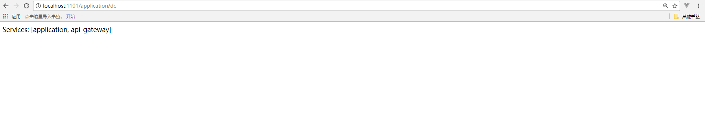

## Zuul 服务网关
### 由来

在微服务架构中，不同的微服务一般会有不同的网络地址，而外部客户端可能需要调用多个服务的接口才能完成一个业务需求。
而让客户端直接与多个微服务进行通信，会出现以下问题：
- 客户端会多次请求不同的微服务，增加了客户端的复杂性
- 存在跨域请求，在一定场景下处理相对复杂
- 认证复杂，每个服务都需要独立认证
- 难以重构，随着项目迭代，可能需要重新划分微服务。如果客户端直接与微服务通信，重构将难以实施
- 某些微服务可能使用了防火墙/浏览器不友好的协议，直接访问会有一定的困难

综上，微服务网关解决方案应运而生，它是介于客户端和服务器端的中间层，所有的外部请求都会先经过微服务网关
### Zuul 介绍

Zuul是Netflix开源的的微服务网关，可与其他Spring Cloud组件配合使用。
#### 主要功能
- 动态路由：动态地将请求路由到不同的后端集群
- 身份认证与安全：识别每个资源的验证要求，并拒绝那些与要求不符的请求
- 审查与监控：在边缘位置追踪有意义的数据和统计结果，从而带来精确的生产试图
- 负载分配：为每一个负载类型分配对应容量，并弃用超出限定值的请求
- 静态响应处理：在边缘位置直接建立部分响应，从而避免其转发到内部集群
- 多区域弹性：跨越AWS Region进行请求路由，旨在实现ELB使用的多样化，以及让系统的边缘更贴近系统的使用者
### 创建服务网关

- 1 . 创建一个Spring Boot项目
- 2 . 在pom.xml中添加Sprng Cloud 与Zuul 服务网关的依赖

```
<parent>
  <groupId>org.springframework.boot</groupId>
  <artifactId>spring-boot-starter-parent</artifactId>
  <version>1.5.4.RELEASE</version>
  <relativePath/>
</parent>

<dependencies>
  <dependency>
    <groupId>org.springframework.cloud</groupId>
    <artifactId>spring-cloud-starter-zuul</artifactId>
  </dependency>
  <dependency>
    <groupId>org.springframework.cloud</groupId>
    <artifactId>spring-cloud-starter-eureka</artifactId>
  </dependency>
</dependencies>

<dependencyManagement>
  <dependencies>
    <dependency>
      <groupId>org.springframework.cloud</groupId>
      <artifactId>spring-cloud-dependencies</artifactId>
      <version>Dalston.SR1</version>
      <type>pom</type>
      <scope>import</scope>
    </dependency>
  </dependencies>
</dependencyManagement>

 <build>
    <plugins>
      <plugin>
        <groupId>org.springframework.boot</groupId>
        <artifactId>spring-boot-maven-plugin</artifactId>
      </plugin>
    </plugins>
  </build>
```
这里添加eureka依赖，是很巧妙的一点。服务网关中，除了上述功能，还需要一个很重要的功能，即api服务列表的动态维护，以应对单个服务的频繁上下线，或者出现故障。
在传统网关中，使用nginx时需要手动维护nginx的配置，或者其他使用数据库表来维护的方式，效果都不恰如人意。
而zuul借助服务注册中心，讲自身作为一个服务注册到注册中心，这里就提到前面的eureka client的缓存功能，作为eureka client的zuul会从eureka server拉取所有的api服务器信息，从而完成作为服务网关的大部分功能

- 3 . 在项目启动类中添加@EnableZuulProxy注解开启Zuul的功能

```
@EnableZuulProxy
@SpringCloudApplication
public class Application {
  
  public static void main(String[] args) {
    new SpringApplicationBuilder(Application.class).web(true).run(args);
  }
  
}
```

- 4 . 配置application.properties，加入服务名、端口号、eureka注册中心的地址

```
spring.application.name=api-gateway
server.port=1101
eureka.client.serviceUrl.defaultZone= http://localhost:8080

```

Zuul服务网关会根据eureka server 获取到的服务；列表发现上面我们启动的服务eureka-client，这时候Zuul就会创建一个路由规则。
每个路由规则都包含两部分，一部分是外部请求的匹配规则，另一部分是路由的服务ID。针对当前示例的情况，Zuul会创建下面的一个路由规则：
转发到eureka-client服务的请求规则为：/eureka-client/**

- 5 . 启动服务，浏览器打开localhost:1101/application/dc验证

